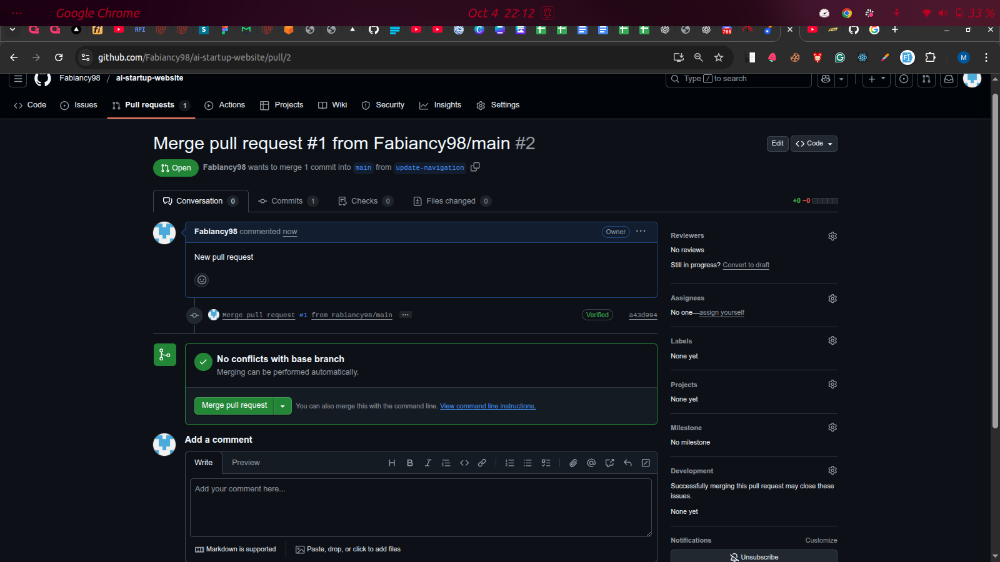

# AI Startup Website

## Project Description
This is my first project as a DevOps engineer, focusing on implementing Git workflows and collaboration practices. The project demonstrates a simple website development process with multiple contributors working on different features through branch-based development.

## Git Workflow Summary

### Initial Setup
- Created the initial repository with a basic index.html file
- Made the first commit and pushed to the main branch

### Feature Development
1. **Navigation Feature**:
   - Created a new branch `update-navigation`
   - Added navigation bar to the website
   - Committed changes and pushed to GitHub
   - Merged changes back to main

2. **Contact Information Feature**:
   - Created a new branch `add-contact-info`
   - Added contact information to the website
   - Committed changes and pushed to GitHub
   - Merged changes back to main

## Project Structure
- `index.html`: Main website file with basic content
- `img/`: Directory containing website images

## Visual References

### Website Screenshots
The following screenshots show the website's progression:

### Pull Request Workflow
The following screenshots demonstrate the GitHub pull request workflow:

## Contributors
- Admin: Initial setup
- Tom: Navigation feature
- Jerry: Contact information feature
